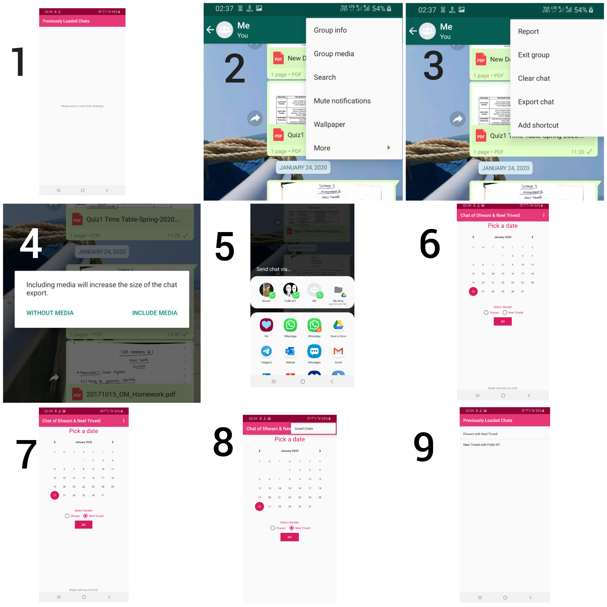
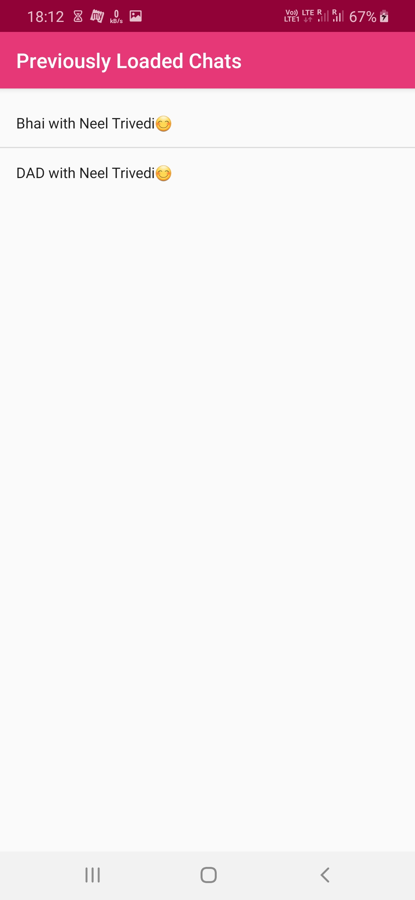
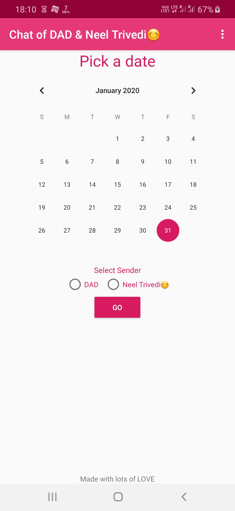
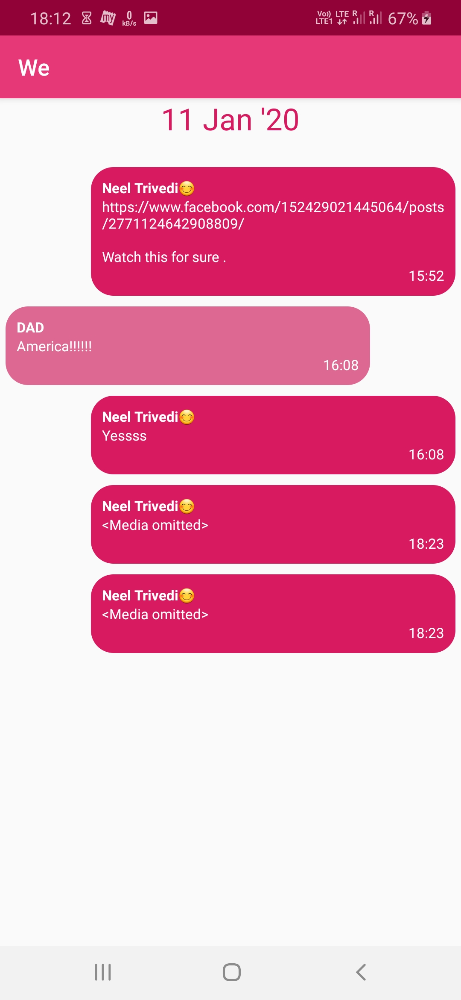

# We

We is an Android application which enables users to query their past WhatsApp chats based on date.

In today's world social media chatting has become a very important medium of communication. Due to busy life we aren't able to meet or directly talk with our loved ones, in such times chats prove to be a very important part in our lives.

Now if you can just go back in your chat history and find what message you sent to your loved one this day 2 years ago, won't it be a memory worth living again?!

So to re-live your chats , here is 'We' app. This enables you to see your WhatsApp chats with any person on a given date.

All you need to do is install this app, export your favourite chat from WhatsApp, open that chat in 'We' and start reliving the memories stored in words.

### Instructions to use the App

1. After installing app using the apk, if you open the app it will ask to you export a chat from whatsapp.

2. Go to whatsapp chat of a person whose chat you want to export. Go to the menu on top right corner and select 'More'

3. Inside more select 'Export Chat' option

4. Now you will see an alert box, select 'WITHOUT MEDIA' in it and then wait till your chats are exported.

5. Once the process is done, you will see a number of options regarding what to do with this exported chat, you will see the logo of 'We' app among this options. Select it.

6. You will be directed to the main screen of the 'We' app. Here the title bar will show the name of the two people involved in the chat. Below that you will see a calendar. Select a date for which you want to see the chats.

7. Select a person as sender from the two options below. And press Go. And start re-living your memories.

8. You do not need to always export the chat from Whatsapp. Once you have exported a chat, you can access it in 'We' app by selecting 'Save chats' option in the menu on top right corner.

9. In this menu you can see the list of all the previously loaded chats and you can select any one of them

### Screenshots

  
